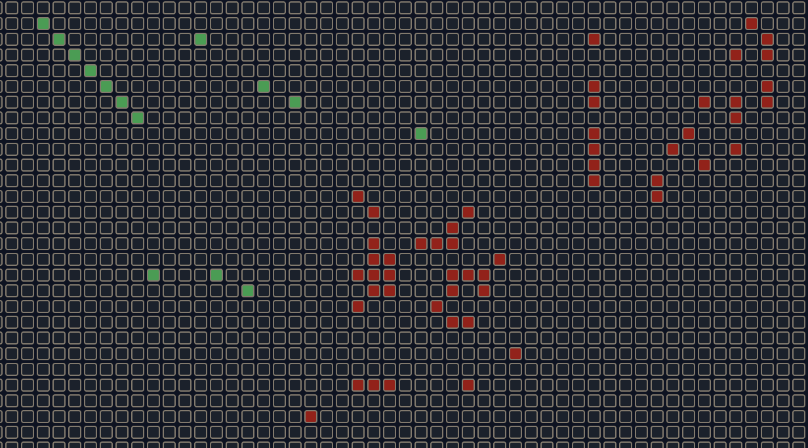
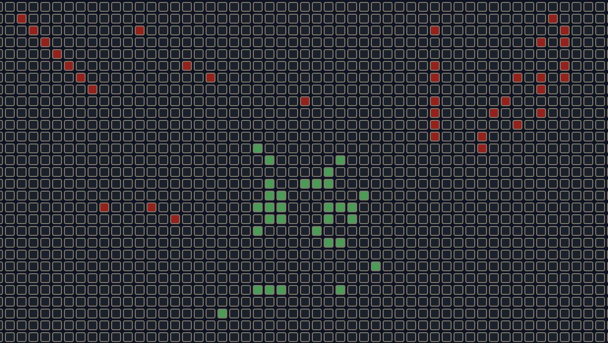
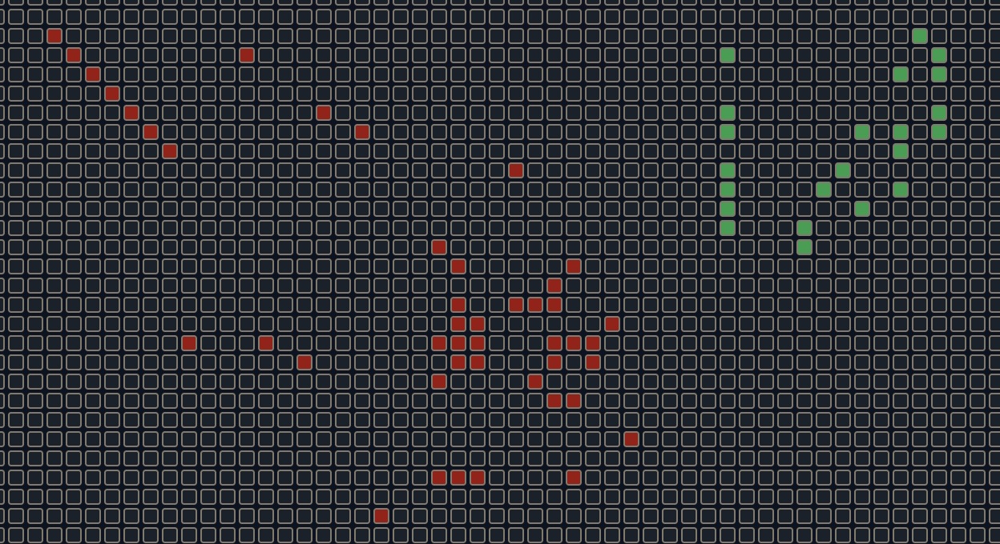
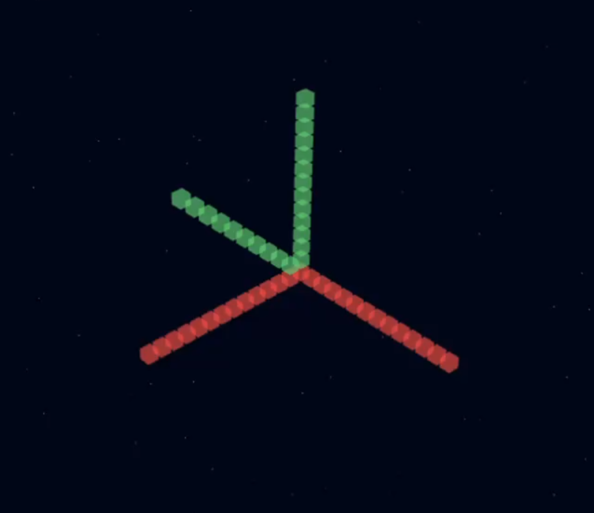
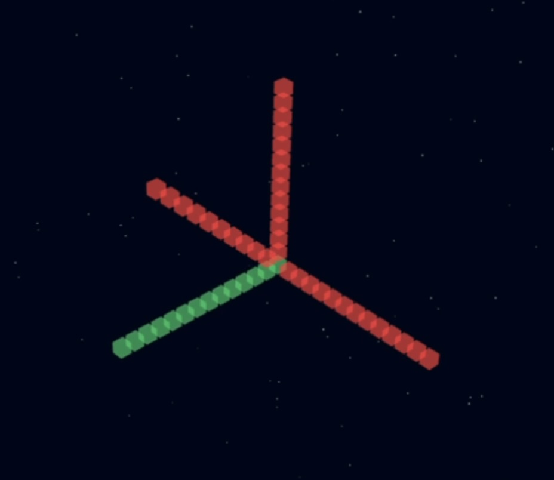
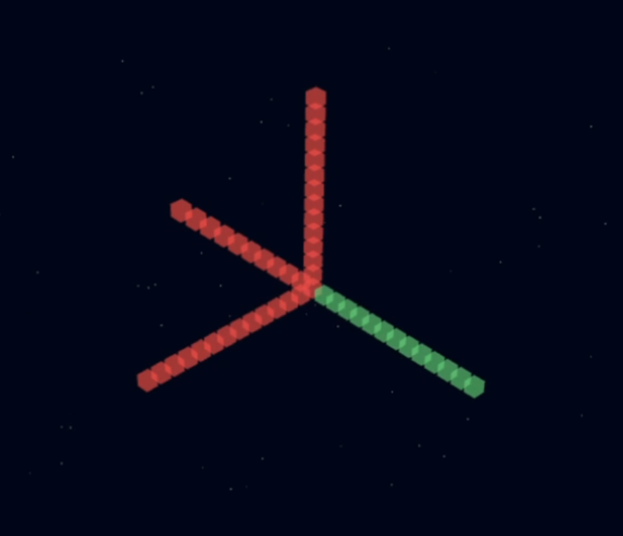

# Realtime Grid Engine

## Demo Screenshots

### 2D Real-Time Multi-Client Example
Three clients interacting with the same 2D grid simultaneously.

<table align="center" border="0" cellspacing="0" cellpadding="0" style="border-collapse: collapse;">
  <tr>
    <td align="center">
      <br/>
      Client 1
    </td>
    <td align="center">
      <br/>
      Client 2
    </td>
    <td align="center">
      <br/>
      Client 3
    </td>
  </tr>
</table>

Code : [Demo-2D](./demo)


### 3D 100×100×100 Space Grid Example
A 3D voxel grid rendered with React Three Fiber, showing real-time cell claiming.

<table align="center" border="0" cellspacing="0" cellpadding="0" style="border-collapse: collapse;">
  <tr>
    <td align="center">
      <br/>
      Client 1
    </td>
    <td align="center">
      <br/>
      Client 2
    </td>
    <td align="center">
      <br/>
      Client 3
    </td>
  </tr>
</table>

Code : [Demo-3D](./grid-3d-demo)

The Realtime Grid Engine is a Redis-backed, N-dimensional real-time coordination server with an accompanying JavaScript/TypeScript client library. It provides atomic cell claiming, deterministic conflict resolution, and WebSocket-based event distribution. The system is designed to operate independently from your main application logic and can be integrated into any application that needs reliable multi-user interaction on grid-like structures.

This repository contains:

- The **Realtime Grid Server** (Go + Redis)
- The **Realtime Grid Client** (`realtime-grid-client` npm package)
- Demos including a 2D reservation interface and a 3D sparse voxel visualization


## Motivation

This project was created after building a real-time theatre reservation system. While implementing seat selection, booking, and real-time conflict handling, several challenges became clear:

- Maintaining seat availability state directly in the backend created lock contention
- Implementing real-time WebSockets inside the main backend increased memory usage and latency
- Every domain (theatre, bus booking, mapping, etc.) required its own custom grid/state logic
- There was no general-purpose, reliable, real-time grid coordination engine that could be reused across applications
- Handling concurrency manually (e.g., with database row locks or optimistic transactions) proved error-prone under load
- Real-time updates across multiple clients were difficult to scale without separating this subsystem

The **Realtime Grid Engine** solves these problems by providing a dedicated, isolated, high-performance real-time coordination service backed by Redis atomic operations and Pub/Sub. It lets your main backend remain simple while this system handles concurrency, claims, and updates.


## What This Solves

- Atomic "first claim wins" semantics without database locking
- Real-time propagation of grid changes to all clients
- Structured state management for grid-based systems
- Support for arbitrary dimensional grids (1D to ND)
- Scalable WebSocket delivery decoupled from your main backend
- Automatic conflict prevention (no two clients can claim the same cell)
- Clean API interface for grid creation and manipulation

The engine becomes the authoritative state holder for any grid-like structure you want to coordinate.


## N-Dimensional Grids

This system supports any number of dimensions. Examples:

- **1D**: Time slots, linear resource pools
- **2D**: Seating systems, parking layouts, floor plans
- **3D**: Voxel data, warehouse layout, multi-level mapping, spatial simulations
- **4D+**: Multi-axis simulations, scientific tools, advanced visualization, availability matrices

The server does not impose any meaning on the dimensions. They are purely structural and driven by your application's needs.


## Example Use Cases

### 2D Use Cases

#### Theatre Booking
- Dimensions: `[rows, seats]`
- Backend creates a grid per show
- Frontend displays seating layout rendered from the grid
- Clients claim seats in real-time
- On checkout, backend marks seats permanently booked in your system

#### Bus / Train Seat Selection
- Dimensions: `[rows, seats]`
- Or for multi-coach trains: `[coach, rows, seats]`
- Multiple clients see seat claims instantly

#### Restaurant Tables
- Dimensions: `[x, y]`
- Grid represents table map, claim for temporary holds

### 3D Use Cases

#### Warehouse / Inventory Mapping
- Dimensions: `[x, y, z]`
- Real-time occupancy of shelves

#### Voxel Environments
- Sparse-enabled; only modified cells are stored or broadcast
- Useful for collaborative 3D tools

#### Sensor Grids
- Real-time activation/deactivation event grids

### High-Dimensional Use Cases

- Scheduling systems `[day, timeSlot, room]`
- Scientific simulations and parameter grids
- High-resolution availability datasets
- Multi-layered mapping and planning tools


## Example Integration with a Backend + Database + Payments

Below is a realistic example demonstrating how this system plugs into a full stack.

### Flow

1. Your backend (e.g., Node, Go, Python, Java) has a domain model for a "Show", "Bus Route", "Warehouse Layout", etc.

2. When the entity is created, your backend **creates a grid** via:

   ```http
   POST /grids
   ```

   and stores:
   - `grid_id`
   - dimensions
   - show/bus route id
   - time window

3. Frontend clients load your domain entity and its associated `grid_id`.

4. They initialize:

   ```ts
   const client = createGridClient({ baseUrl, gridId });
   await client.getInitialState();
   await client.connect();
   ```

   The frontend shows the layout and handles claim or release calls.

5. During checkout or commit, your main backend:
   - Reads the list of claimed cells
   - Validates them (e.g., no conflicts)
   - Processes payment
   - Updates its own database tables
   - Optionally updates the grid by replacing `"held:user123"` with `"booked:order456"`

6. After booking:
   - Your domain database (MySQL/PostgreSQL) stores the final booking data
   - The grid engine stays responsible only for real-time state and coordination

### Why This Architecture Is Ideal

- Your domain backend stays clean and focused
- Grid engine isolates concurrency concerns
- Redis handles atomic operations efficiently
- WebSockets are confined to a lightweight, specialized server


## Running the Server

### Option 1: Local Go Build

Install Go and Redis.

Start Redis (for example using Docker):

```bash
docker run -d --name redis-grid -p 6379:6379 redis:7
```

Run server:

```bash
cd server
go run ./cmd/api
```

Server will listen on:

```
http://localhost:8080
```

### Option 2: Docker

Build image:

```bash
cd server
docker build -t realtime-grid-api .
```

Run:

```bash
docker run --rm \
  -p 8080:8080 \
  -e REDIS_ADDR=host.docker.internal:6379 \
  realtime-grid-api
```

On Linux add:

```bash
--add-host=host.docker.internal:host-gateway
```

### Option 3: Docker Compose (Recommended)

Included `docker-compose.yml`:

```bash
cd server
docker compose up --build
```

Starts:
- Redis at `localhost:6379`
- API at `localhost:8080`


## Using the Client

Install:

```bash
npm install realtime-grid-client
```

Basic usage:

```ts
import { createGridClient } from "realtime-grid-client";

const client = createGridClient({
  baseUrl: "http://localhost:8080",
  gridId: "g_abc123"
});

const state = await client.getInitialState();
await client.connect();

client.onCellUpdate(ev => console.log(ev));

await client.claim([2, 3], "held:user123");
await client.release([2, 3]);
```

See `client/README.md` for full documentation.


## Project Structure

```
realtime-grid/
  server/                 # Go server
    cmd/api/              # Server entry point
    internal/             # Core logic
    docker-compose.yml    # Docker setup
    README.md             # Server documentation
  client/                 # NPM client SDK
    src/                  # TypeScript source
    README.md             # Client documentation
  demo/                   # Simple HTML demo
  grid-3d-demo/           # 3D React/Three.js demo
  README.md               # This file
```


## Database Integration (MySQL Example)

Store created grids:

```sql
CREATE TABLE grids (
  id VARCHAR(255) PRIMARY KEY,
  dimensions JSON,
  created_at TIMESTAMP,
  domain_entity_id VARCHAR(255)
);
```

Store bookings:

```sql
CREATE TABLE bookings (
  id INT AUTO_INCREMENT PRIMARY KEY,
  user_id VARCHAR(255),
  grid_id VARCHAR(255),
  coord_x INT,
  coord_y INT,
  seat_status VARCHAR(50),
  created_at TIMESTAMP
);
```

### Flow

1. Create grid → Save `grid_id`
2. Users claim cells via client
3. On checkout:
   - Backend checks their claimed seats
   - Places booking rows
   - Confirms payment
   - Backend updates the grid (if needed)

**The grid engine never stores business data.**  
Your database holds all authoritative bookings.


## Why This Works Well

- Eliminates race conditions in seat/resource selection
- Scales horizontally via Redis Pub/Sub
- Reduces load on your main backend by isolating real-time ops
- Works for any kind of grid, any size, any dimension
- Enables fast UI rendering through sparse updates
- Avoids complex locking mechanisms in your DB backend

## Links

- **NPM Package**: [realtime-grid-client](https://www.npmjs.com/package/realtime-grid-client)
- **Server Documentation**: [server/README.md](./server/README.md)
- **Client Documentation**: [client/README.md](./client/README.md)
